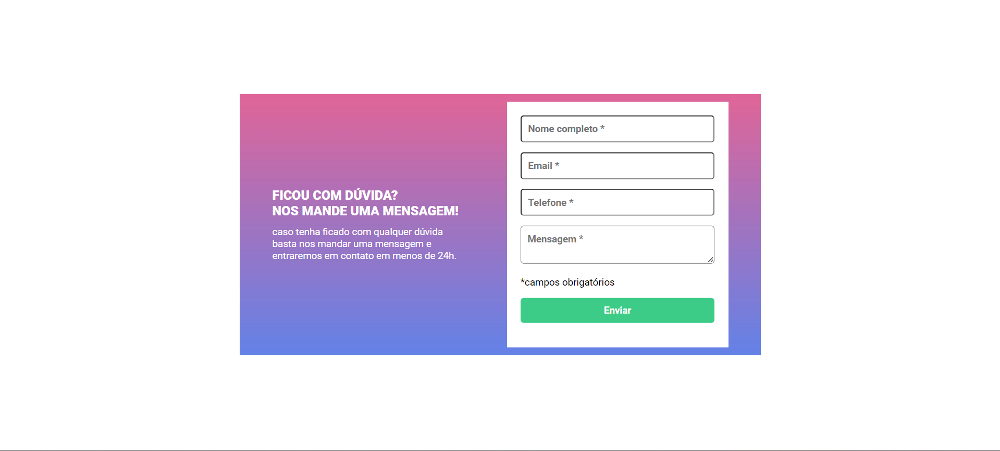

<h1>Formulário de dúvida</h1>

Projeto desenvolvido dentro do curso de desenvolvimento Web Fullstack, DevQuest. O projeto consiste em um formulário com validação, para enviar alguma mensagem de duvida. 

O objetivo deste projeto foi Criar um formulário e realizar a validação dos campos, via JavaScript puro, ao clicar no botão enviar. 
  

O formulário contem quatro campos e um botão, sendo eles nome completo, e-mail, telefone, mensagem e o botão enviar.

Ao clicar para enviar o formulário, se caso algum campo não estiver preenchido, a borda dos campos ficará vermelha e uma mensagem
   de "campo obrigatório" irá aparecer embaixo do campo que não foi preenchido.  
   Se todos os campos estiverem preenchidos corretamente, a borda de cada um ficará verde.

Utilizando das tecnologias HTML, CSS e JavaScript.

  
  
  
  
  

